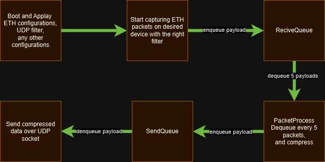
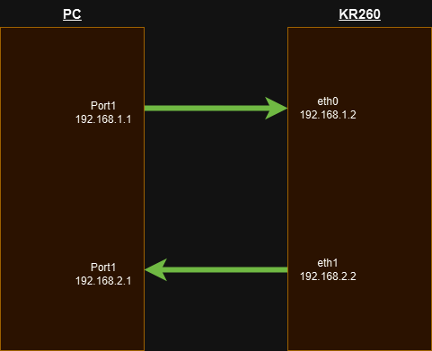

# Project Overview

This project is focused on creating a PetaLinux-based operating system for the **Xilinx KRIA KR260** board and developing an embedded software application. The application is designed to handle Ethernet packet management through three primary threads:

1. **Capture Packets**: Captures Ethernet packets from the specified interface.
2. **Process Packets**: Processes the captured packets using compression or other algorithms.
3. **Send Packets**: Transmits the processed packets to a specified destination.

## Features

- **Ethernet Packet Capture**: Efficiently captures packets using `libpcap`.
- **Packet Processing**: For now applays compression but can done any algorithem.
- **Packet Transmission**: Sends processed packets via UDP sockets.
- **Multi-Threaded Design**: Leverages threading for parallel processing.
- **Robust Error Handling**: Ensures system stability and reliability.

## System Requirements

- **Hardware**: Xilinx KRIA KR260 StarterKit board.
- **Operating System**: PetaLinux.
- **Software Dependencies**:
  - `g++` (C++17 support)
  - `libpcap` (Packet capture library)
  - `zlib` (Compression library)
- **Development Tools**:
  - Makefile for build automation.
  - Xilinx tools for PetaLinux development.

## Build Instructions

1. **Clone the Repository**:
   ```bash
   git clone `https://github.com/HarelGrecht/MUST.git`
   cd NetAdapt
   *For mock_up*
   sudo make clean && sudo make mock_compile && sudo make mock_run
   *For Normal*
   sudo make clean && sudo make normal_compile && sudo make normal_run
    ```

2. **Application Flow**:
The application users a multi-threaded approach to handle packets efficiently:
    2.1. **Packet Capture**:
        - Captures packets from a networrk interface using `libpcap`.
    2.2. **Packet Processing**:
        - Compresses the captured packet using `zlib`.
    2.3 **Packet Sending**:
        - Sends the processed packets over a UDP connection.
    2.4. - **File directory system**:
    ```sh
    NetAdapt/
    ├── Drawings/
    ├── Includes/
    │   ├── ETH_Status.hpp
    │   ├── Exceptions.hpp
    │   ├── Global_Defines.hpp
    │   ├── GPIO_Handler.hpp
    │   ├── Libraries.hpp
    │   ├── Network_Config.hpp
    │   ├── Packet_Capture.hpp
    │   ├── Packet_Process.hpp
    │   ├── Packet_Send.hpp
    │   ├── Queue.hpp
    ├── Sources/
    │   ├── ETH_Status.cpp
    │   ├── GPIO_Handler.cpp
    │   ├── Main.cpp
    │   ├── Network_Config.cpp
    │   ├── Packet_Capture.cpp
    │   ├── Packet_Process.cpp
    │   ├── Packet_Send.cpp
    │   ├── Queue.cpp
    ├── .gitignore
    ├── Makefile
    ├── Readme.md
    ```
    2.5. **Block Diagram**:\
        \
    2.6. **Network Diagram**:\
        

### Author
- Harel Grecht
